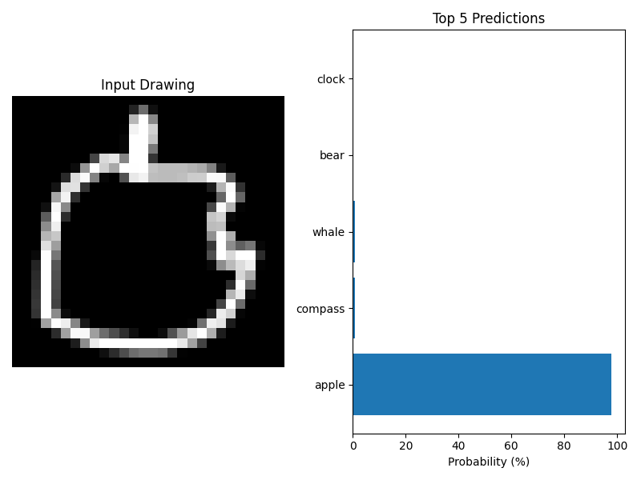

# cnn_quickdraw
The process of training a neural network on the quick draw dataset.
I obtained an accuracy of 72,39% on 126 different classes.

## Step 1.
Download the training data.

1. download_classes.py is a script for downloading the bitmap numpy files from the quick draw dataset, where the name of a file is in classes.txt.
2. it creates a directory quickdraw_data with all the downloaded files.

You can change the script to downlod what classes you want.

## Step 2.
Train the CNN.

1. training.py is the script for training the CNN 
2. You can change the number of epoches from 30 to less - In my case the script runned for about 14 hours, but there was no significant increase in accuracy from epoch 20 to epoch 30 (+2,5% increase in accuracy for 4-5 hours of training).
3. The script is training the CNN on a subset of the downloaded files - about 3-5% of the downloaded data.

I also added 2 models(.h5, .tflite) trained by me, if you don't want to do the training.  

## Step 3
Use the CNN.

1. The scrpits saves the model at every epoch in hdf5 format and it remembers the best in quickdraw_model_best.
2. check.py is a script that takes from the user a category and an index; for that image it displays the top 5 probabilities.

